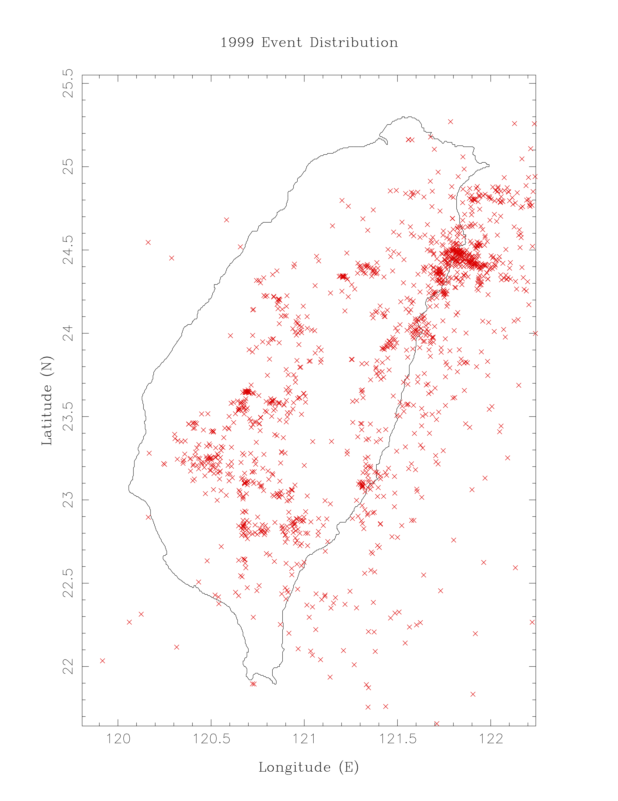

## Task: Plot the `epicentral distribution`.

1. **Coastal line**
   - From `1999.lis`.
2. **Symbols**
   - Different magnitude in different size of the symbol.
3. **Color**
   - Different focal depth in different color.

## Task: Linear Regression `Plots`

1. **Read data**: 
   - Epicentral distance as $X_i$ 
   - P travel time as $Y_i$
   - Data is provided in `ppfile.txt`

2. **Fit a linear model**: 
   - The equation for the line: $Y_i = a \cdot X_i + b$
   - Fit the data to this linear equation.

3. **Find the following values**:
   - Constant $a$
   - Constant $b$
   - **Standard deviation ($s.d.v.$)** of the fit
   - **Linear correlation coefficient ($R$)**
   - **Standard deviation of $a$ and $b$**

4. **Output the results** in the following order:
   - Constants $a$ and $b$
   - Standard deviation of the fit
   - Linear correlation coefficient $R$
   - Standard deviation of constants $a$ and $b$

5. **Plotting results**
   - See slides.
   - 